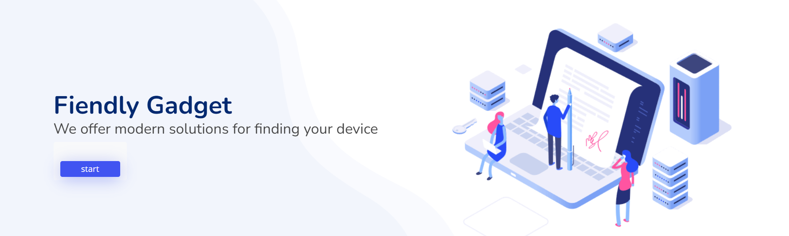

# Friendly_Gadget
ALX-Project_Portfolio
# Friendly Gadget

## Overview

Friendly Gadget is a web-based platform designed to help people understand your gadget choices. It will be your one point of reference for a complete informative guide about a product or service of your mobile or computer devices

## Features

The Friendly_Gadget APP includes the following key features:

1. **Get the Best Device:** Users can get the device that is suitable for their purposes with ease, by displaying the search results based on your requirements

2. **Identify your Device:** Users can view the device's specifications and capabilities and identify each characteristic separately.

## Installation

## Usage

1. **Search for a suitable Device:**
   - You will be great with your landing page 
   - Click on “Get Start” and you will be directed to the search section form 
   - Choose your device category (PC or mobile) and start defining your specific purpose and purposes.
   - You can also explore the latest models and view their details in our latest Models

2. **Search and preview:**
     - Matching search results appear and simplified information for the device description is displayed.
     - Use the “Read More” feature to see product details.
